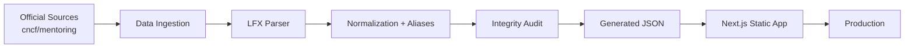

# Contributing to OSSGrid 🌐

Thanks for contributing to OSSGrid.

OSSGrid is maintained with a simple rule:

> **If you claim an issue, own it. Communicate early, ship it properly, and don't leave other contributors blocked.**

Please read this before asking for or starting an issue.

---

## Contributor Rules

### 1. Claim only what you can finish

Do not ask to be assigned multiple issues just to reserve them.

Once an issue is assigned to you, you are expected to make meaningful progress and complete it within the **same weekend**, unless the issue itself has a different timeline.

If you are blocked, comment on the issue before the deadline.

### 2. No progress + no communication = unassigned

If there is:

- no meaningful progress,
- no PR,
- and no communication

by the end of the agreed timeline, the issue may be reassigned.

You may also be removed from the **Active Contributors** list.

Previous commits/authorship will never be altered.

### 3. One issue → one focused PR

Do not mix unrelated refactors, formatting changes, UI redesigns, or dependency upgrades into your PR.

Keep the diff focused on the assigned issue.

### 4. Understand the code before changing it

Do not patch generated JSON manually when the source of truth is the ingestion pipeline.

Fix the parser/source/configuration and regenerate the data.

---

# Architecture



OSSGrid follows a **static-first architecture**.

There is no production database for the mentorship dataset.

The basic flow is:

```text
Official Source
      ↓
fetch-lfx-data.ts
      ↓
lfx-parser.ts
      ↓
Normalization / Metadata
      ↓
audit-data.ts
      ↓
public/data/*.json
      ↓
Next.js Build
      ↓
Static Deployment
```

### Important directories

```text
.github/workflows/     CI and automatic data sync
docs/                  Architecture and verification docs
public/data/           Generated datasets
public/logos/          Organization logos

scripts/
├── fetch-lfx-data.ts  Data ingestion
├── audit-data.ts      Integrity checks
├── lfx-source.json    Pinned upstream source
├── org-metadata.json  Curated organization metadata
├── lib/               Parser + normalization logic
└── tests/             Parser/data regression tests

src/
├── app/               Next.js routes
├── components/        UI components
├── hooks/             Client hooks
└── lib/               Types, search and data utilities
```

For deeper architecture details, read:

**[`docs/ARCHITECTURE.md`](./docs/ARCHITECTURE.md)**

---

# Working on an Issue

## Data / parser issue

When fixing parser behavior:

1. Add or update a regression fixture.
2. Reproduce the bug.
3. Fix the parser.
4. Regenerate the dataset.
5. Run the audit.
6. Verify the affected records against the official source.

Do not solve parser bugs by manually editing generated JSON.

---

## Organization metadata

Edit:

```text
scripts/org-metadata.json
```

Then regenerate and validate the dataset.

---

## New upstream cohort

Use the existing ingestion pipeline.

Do not manually copy projects into `projects.json`.

---

# Required Checks

Before opening or updating your PR:

```bash
npm run test:data
npm run audit:data
npm run check:data
npm run lint
npm run build
```

Your PR should not be marked ready until the relevant checks pass.

---

# Data Accuracy

For mentorship data:

**Official upstream sources win.**

Do not guess:

* project names
* mentors
* technologies
* URLs
* cohort information
* organizations
* project status

If information is unavailable, represent it as unavailable rather than inventing it.

When fixing ingestion, make sure an official source record is either:

1. represented correctly in OSSGrid, or
2. intentionally excluded with a documented reason.

---

# Pull Request Guidelines

A good PR should contain:

* **Target the `main` branch**: Always create pull requests targeting **`main`** (do **not** target `develop`).
* a clear title
* reference to the assigned issue
* a short explanation of the fix
* screenshots for UI changes
* source links for data corrections
* tests for parser/data regressions
* no unrelated changes

Use:

```text
Fixes #<issue-number>
```

when the PR fully resolves an issue.

---

# Contributor Status

Being listed as an **Active Contributor** means you are actively helping maintain or improve OSSGrid.

Assignment alone does not count as contribution.

Repeatedly claiming issues without completing them may result in:

* the issue being reassigned
* future assignments being declined
* removal from the Active Contributors list

Consistent contributors who communicate well and ship quality changes will be prioritized for larger issues.

### Active Contributors

| Contributor | GitHub | Role / Focus | Status |
|---|---|---|---|
| Rajat Srivastav | [@rajatrsrivastav](https://github.com/rajatrsrivastav) | Maintainer / Core | Active |
| Anand Mishra | [@anand-242003](https://github.com/anand-242003) | Core / Frontend | Active |
| Mitul Bhatia | [@mitul-bhatia](https://github.com/mitul-bhatia) | Contributor / Frontend | Active |
| Krishna Gehlot | [@NSTKrishna](https://github.com/NSTKrishna) | Contributor / Frontend | Active |
| Khuswant Rajpurohit | [@khuswant18](https://github.com/khuswant18) | Contributor / Frontend | Active |

---

## Need more time?

That's completely fine — communicate.

A simple issue comment is enough:

> Blocked on X. I need until <date>. Current progress: <short update>.

Silence is the problem, not needing extra time.

---

**Build carefully. Verify against the source. Leave the codebase better than you found it. ❤️**
