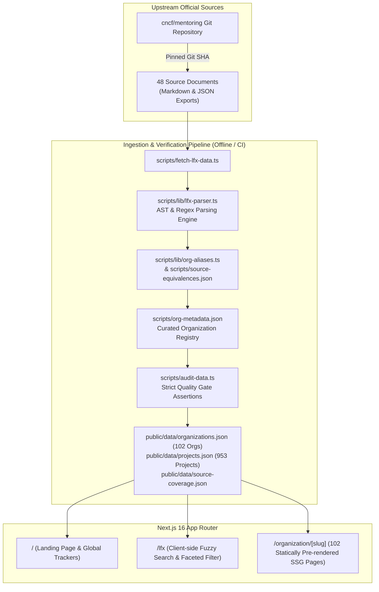

# OSSGrid Architecture 🏛️

This document describes the design philosophy, technical architecture, data pipeline, and system internals of **OSSGrid**.

---

## 1. System Overview & Design Philosophy

OSSGrid is a high-performance mentorship explorer designed around three guiding principles:

1. **Zero Runtime Database (Static-First)**: The entire dataset (102 organizations, 953 projects) is compiled into static JSON at build time. Reads are instant, zero-cost, serverless, and resilient against API outages.
2. **Byte-for-Byte Reproducibility**: The dataset is derived deterministically from pinned upstream Git commits of official open-source foundations (e.g., `cncf/mentoring`). Every project has exact line-level source provenance.
3. **Strict Quality Gates**: Data is validated against runtime assertions before it can be merged into production. If upstream data format drifts or corrupted fields enter the pipeline, CI halts immediately.

---

## 2. Data Pipeline & Provenance Layer

The data pipeline lives entirely in `scripts/` and executes using Node.js + `tsx`.

### 2.1 Pinned Upstream Sources (`scripts/lfx-source.json`)
To avoid flaky builds from changing upstream repositories, OSSGrid locks:
* **`revision`**: Immutable 40-character commit SHA (e.g., `17ef996a1fc7b266dbf2cfa6362752d6bb5c4c3d`).
* **`paths`**: Alphabetical list of all 48 tracked cohort files from 2019 to 2026.
* **`counts`**: Pre-verified project record counts for each individual file.
* **`hashes`**: SHA-256 content hashes for each individual file.

### 2.2 Ingestion Engine (`scripts/fetch-lfx-data.ts`)
1. **Fetch / Read**: Downloads the 48 source files from GitHub Raw or reads them from a local `--source-dir` cache.
2. **Priority Ordering**: Upstream files often contain duplicates across different stages. The pipeline establishes a strict precedence hierarchy:
   * **Priority 0**: `lfx-export.json` (Machine-readable export, highest authority).
   * **Priority 1**: `README.md` / `selected_projects.md` (Accepted project records).
   * **Priority 2**: `project_ideas.md` (Proposal-only entries; marked as `"status": "proposed"` in the UI).
3. **Deduplication & Reconciliation**:
   * Scoped project identity key: `${organizationId}-${year}-t${termIndex}`.
   * Strong links (official LFX portal URLs, GitHub issue URLs) are matched first.
   * Titles are reconciled via `scripts/source-equivalences.json` (e.g., mapping historical consolidated 2020 Q1 completed-project tables to original proposal records).
   * Distinct LFX URLs are never collapsed even if titles or issues repeat.

### 2.3 Parsing Engine (`scripts/lib/lfx-parser.ts`)
Upstream CNCF files span 7 years of varying markdown formatting styles:
* **Headings**: Handles H1 to H5 headings, bold-text headings (`**Project Title**`), mixed hierarchy depths (e.g. `kube-burner` and `Kyverno` subgroups).
* **Field Labels**: Extracts descriptions, expected outcomes, skills, and issue links whether labeled with Markdown bold (`**Skills:**`), plain text (`Skills:`), or bullet markers (`*`, `-`).
* **Mentors**: Handles Markdown links (`[Name](https://github.com/handle)`), raw handles (`@handle`), obfuscated email addresses (`user AT example DOT com`), and handle-only mentions (`nameIsHandle: true`).
* **Sanitization**: Strips scraper artifacts and illegal characters while retaining markdown links and technical descriptions.

### 2.4 Metadata Registry & Canonical Aliases
* **`scripts/org-metadata.json`**: Authoritative directory of 102 organizations containing official name, description, website, GitHub repository URL, and browsing category.
* **`scripts/lib/org-aliases.ts`**: Maps organizational variant names (e.g., `prometheus-operator`, `k8s`, `opentelemetry-collector`) to their canonical parent organization ID.

### 2.5 Audit & Quality Gate (`scripts/audit-data.ts`)
Run after compilation and during CI. It asserts:
* **Schema Integrity**: Non-empty fields, integer years and term indices.
* **URL Validity**: Ensures zero markdown artifacts, unbalanced brackets, or malformed protocols in URLs.
* **Source Lineage**: Every single project must link back to an exact file path, line number, revision, and content hash in `cncf/mentoring`.
* **Coverage Bi-Directionality**: Every project record in source coverage must map to an active project ID, and every project must map to a source line.
* **Person Names**: Rejects unparsed HTML, markdown junk, or URLs inside mentor/mentee names.

---

## 3. Frontend Architecture

OSSGrid's frontend is built using **Next.js 16 (App Router)**, **React 19**, **Tailwind CSS v4**, and **Framer Motion**.

### 3.1 Route Breakdown

#### `/` — Landing Page (`src/app/page.tsx`)
* **Client-side landing page** showcasing high-level mentorship programs (LFX, GSoC, Outreachy, etc.).
* Features an interactive canvas ([`src/components/GlobeCanvas.tsx`](../src/components/GlobeCanvas.tsx)) and beginner onboarding guides.

#### `/lfx` — Mentorship Explorer (`src/app/lfx/page.tsx`)
* **Interactive Client Component** that loads `public/data/organizations.json` into memory.
* **Fuzzy Search**: Implemented via [Fuse.js](https://fusejs.io/) in `src/lib/search.ts` across org names, project titles, tech tags, and mentor names.
* **Reactive Multi-Facet Filtering**: Powered by `src/lib/data.ts`, offering filtering across terms, categories, technologies, and years.
* **URL Param Synchronization**: `src/hooks/useFilterState.ts` bi-directionally syncs all active filters to browser query params (e.g. `?terms=2026+Term+3&tech=Go`), making every search state shareable.

#### `/organization/[slug]` — Organization Detail Pages (`src/app/organization/[slug]/page.tsx`)
* **Static Site Generation (SSG)**: Statically generates pages for all 102 organizations during `npm run build` using `generateStaticParams()`.
* **Zero Client Waterfall**: Reads `public/data/organizations.json` directly from the filesystem at build time.
* **Visual Components**:
  * Historical participation heatmaps.
  * Recharts visual timeline of project counts per term.
  * Full chronological archive of projects, upstream issue links, LFX links, and mentors.

---

## 4. CI/CD & Automation

OSSGrid maintains two GitHub Actions workflows:

### 1. PR & Push Gate (`.github/workflows/verify-data.yml`)
Triggers on every PR and push to `main`:
1. `npm run test:data` — Runs 17 unit tests verifying parser edge cases and fixture handling.
2. `npm run audit:data` — Audits `public/data/` for schema integrity, URL hygiene, and coverage.
3. `npm run check:data` — Re-fetches the pinned source revision and requires byte-for-byte identity against committed files.
4. `npm run lint` — ESLint verification.
5. `npm run build` — Full static production build.

### 2. Daily Upstream Sync (`.github/workflows/sync-data.yml`)
Runs daily at 6:00 AM UTC and supports manual trigger:
* Discovers changes in upstream CNCF mentorship cohorts.
* Automatically verifies against tests and audits.
* Opens a Pull Request if data has changed, preserving reviewability.

---

## 5. Summary of Data Files

| File | Purpose | Size / Records |
|---|---|---|
| `public/data/organizations.json` | 102 organizations with nested project records | ~800 KB |
| `public/data/projects.json` | Flat array of 953 project records | ~1.1 MB |
| `public/data/source-coverage.json` | Audit trail mapping each source line to project IDs | ~200 KB |
| `scripts/lfx-source.json` | Source lock file with SHA-256 hashes and project counts | ~8.6 KB |
| `scripts/org-metadata.json` | Authoritative organization names, URLs, categories | ~51 KB |
| `scripts/source-equivalences.json` | Canonical mapping for historical consolidated projects | ~2 KB |
